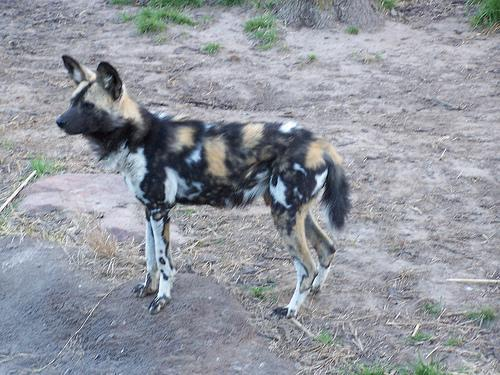

<div align="center">


[](https://github.com/xiuyu0000/mindhub/blob/main/LICENSE.md)
[](https://github.com/psf/black)

English | [Chinese](README.md)

[MindHub Introduction](##MindHub Introduction) |
[Installation](##Installation) |
[Get Started](##Quick Start) |
[Features](##Features) |
[Tutorials](##Tutorials) |
[Model List](##Model List)

</div>

## MindHub Introduction

`MindHub` is a model application tool in the `MindSpore` ecosystem, which is committed to providing users with convenient and fast model loading and inference functions. The main features of MindHub are as follows:

- **Fast Loading**: Users can quickly load pre-trained models of `MindSpore` using `MindHub`, without the need to download and process model parameters themselves. With just a few lines of code, you can easily load the model and perform inference.
- **Easy to Use**: `MindHub` provides a simple and easy-to-use Python API, allowing users to easily use pre-trained models for inference in their own Python code. The API usage method is simple and clear, with good readability and ease of use.

## Installation

### Dependencies

- tqdm
- Pillow
- numpy>=1.17.0
- mindspore>=2.0.0

```shell
pip install -r requirements.txt
```

Users can follow the [official guidance](https://www.mindspore.cn/install) and choose the most suitable version of MindSpore for your hardware platform. If you need to use it under distributed conditions, you also need to install [openmpi](https://www.open-mpi.org/software/ompi/v4.0/).

The following instructions assume that the user has correctly installed the relevant dependencies.

### Installation from Source

The latest MindCV on GitHub can be installed using the following command.

```shell
pip install https://github.com/xiuyu0000/mindhub/releases/download/v0.0.1/mindhub-0.0.1-py3-none-any.whl
```

## Get Started

Before getting started with MindHub, you can read the [Custom Model Tutorial](tutorials/custom_model.md) of MindHub, which can help users quickly understand the various important components of MindHub and the use of various model functions.

Here are some code examples for you to quickly experience.

```python
import mindhub as hub

net = hub.Model("tinydarknet_imagenet", pretrained=True)
print(net.infer(data_path="./data/infer_example.JPEG", json_path="./label_map.json"))
```

```text
Matching local models: []
Matching remote models: ['tinydarknet_imagenet']
tinydarknet_imagenet is not installed!
4096B [00:00, 2369637.13B/s]           
20480B [00:00, 6247225.16B/s]           
4096B [00:00, 1779006.85B/s]           
5120B [00:00, 2905538.69B/s]           
4096B [00:00, 2582274.04B/s]           
Downloading data from https://download.mindspore.cn/models/r1.9/tinydarknet_ascend_v190_imagenet2012_official_cv_top1acc59.0_top5acc81.84.ckpt (10.4 MB)

file_sizes: 100%|██████████████████████████| 10.9M/10.9M [00:00<00:00, 23.1MB/s]
Successfully downloaded file to ./tinydarknet_ascend_v190_imagenet2012_official_cv_top1acc59.0_top5acc81.84.ckpt
Data Path: ./data/infer_example.JPEG
[{'275': 'African hunting dog'}]
```



## Features


The current version of MindHub includes functions such as model search, model installation/removal, and model loading. The specific usage methods are as follows.

### Model Search

MindHub provides the `list_models` interface to search for models. By outputting the possible model names that match the model name, it returns a list of possible model names in the local and remote repositories for users to make further judgments.

```python
import mindhub as hub
# List the pre-trained model names that meet the conditions
hub.list_models("tinydarknet")
```

```text
Matching local models: []
Matching remote models: ['tinydarknet_imagenet']
([], ['tinydarknet_imagenet'])
```

In the example, `tinydarknet` searched does not match locally, but matches `tinydarknet_imagenet` in the remote repository.

### Model Installation

MindHub provides the `install_model` interface to install the required model.

```python
hub.Model.install_model("tinydarknet_imagenet")
```

```text
Matching local models: []
Matching remote models: ['tinydarknet_imagenet']
tinydarknet_imagenet is not installed!
4096B [00:00, 2120447.94B/s]           
20480B [00:00, 7109107.50B/s]           
4096B [00:00, 1644006.62B/s]           
5120B [00:00, 1940438.83B/s]           
4096B [00:00, 2142128.33B/s]           
'~/.mindhub/tinydarknet_imagenet'
```

At the same time, MindHub also provides the `local_models_info` interface, which can further view the detailed information of local models.

```python
print(hub.local_models_info("tinydarknet_imagenet"))
```

```text
{'model_name': 'tinydarknet_imagenet', 'pretrained': True, 'paper': '', 'model_type': 'image/classification'}
```

In the example, since `tinydarknet` was discovered during model search, the required model does not exist in the local model registry, but exists in the remote repository. Therefore, it can be installed through `install_model`. After installation, the detailed information of `tinydarknet_imagenet` is registered in the local model information table, and can be viewed through the `local_models_info` interface.

### Model Removal

For unwanted models that have been installed, MindHub provides the `remove_model` interface to delete the model from the local model registry and delete the corresponding model file.

```python
hub.Model.remove_model("tinydarknet_imagenet")
```

```text
~/.mindhub/tinydarknet_imagenet has been successfully deleted.
```

In the example, we deleted the `tinydarknet_imagenet` model that was just installed.

### Model Loading

MindHub provides a `Model` class that allows loading the required models by either providing the local model file path and model name or just the model name.

1.  Loading Local Model Files

To load a local model file, the user needs to input the required model name, the directory path of the model file (For more details on the model file, please refer to the [Custom Model Tutorial](tutorials/custom_model.md)) and whether to download the pre-trained model.

```python
net = hub.Model(model_name="tinydarknet_imagenet", 
                directory="{YOUR_PATH}/tinydarknet_imagenet/", pretrained=True)
```

```text
Downloading data from https://download.mindspore.cn/models/r1.9/tinydarknet_ascend_v190_imagenet2012_official_cv_top1acc59.0_top5acc81.84.ckpt (10.4 MB)

file_sizes: 100%|██████████████████████████| 10.9M/10.9M [00:00<00:00, 22.3MB/s]
Successfully downloaded file to ./tinydarknet_ascend_v190_imagenet2012_official_cv_top1acc59.0_top5acc81.84.ckpt
```

In the above example, the `tinydarknet_imagenet` model is loaded from the `./tinydarknet_imagenet/` directory, and the pre-trained model is also downloaded and loaded.

2.  Loading Model by Name

To load a model by name, the user only needs to input the model name and whether to download the pre-trained model.

```python
net = hub.Model(model_name="tinydarknet_imagenet", pretrained=True)
```

```text
Matching local models: []
Matching remote models: ['tinydarknet_imagenet']
tinydarknet_imagenet is not installed!
4096B [00:00, 2369637.13B/s]           
20480B [00:00, 6247225.16B/s]           
4096B [00:00, 1779006.85B/s]           
5120B [00:00, 2905538.69B/s]           
4096B [00:00, 2582274.04B/s]           
Downloading data from https://download.mindspore.cn/models/r1.9/tinydarknet_ascend_v190_imagenet2012_official_cv_top1acc59.0_top5acc81.84.ckpt (10.4 MB)

file_sizes: 100%|██████████████████████████| 10.9M/10.9M [00:00<00:00, 23.1MB/s]
Successfully downloaded file to ./tinydarknet_ascend_v190_imagenet2012_official_cv_top1acc59.0_top5acc81.84.ckpt
```

In the above example, the model search matches that the model is not registered in the local model registry. However, the model is present in the remote repository, so it is installed first, and then the model is loaded with the downloaded pre-trained weights.

> Note: If the model name is already registered in the local model registry, it can be loaded directly without any further action. If the model name is not in the local model registry, it needs to be confirmed whether it exists in the remote repository. If it exists, it needs to be installed first, and if it does not exist, it will directly report an error.

### Model Inference

Inference is the fundamental requirement of the models in MindHub and is performed according to the method.

- Infer a single image.

```python
print(net.infer(data_path="./data/infer_example.JPEG", json_path="./label_map.json"))
```

```text
Data Path: ./data/infer_example.JPEG
[{'275': 'African hunting dog'}]
```

- Infer all the images in the dir.

```python
import os

dataset_url = "https://mindspore-website.obs.cn-north-4.myhuaweicloud.com/notebook/datasets/intermediate/Canidae_data.zip"
root_dir = "./"

if not os.path.exists(os.path.join(root_dir, 'data/Canidae')):
    hub.DownLoad().download_and_extract_archive(dataset_url, root_dir)

print(net.infer(data_path="./data/Canidae/val/dogs/", json_path="/tinydarknet_imagenet/label_map.json"))
```

```text
Data Path: ~/data/Canidae/val/dogs/
[{'158': 'toy terrier'}, {'151': 'Chihuahua'}, {'151': 'Chihuahua'}, {'161': 'basset'}, {'151': 'Chihuahua'}, 
{'263': 'Pembroke'}, {'263': 'Pembroke'}, {'151': 'Chihuahua'}, {'151': 'Chihuahua'}, {'151': 'Chihuahua'}, 
{'171': 'Italian greyhound'}, {'151': 'Chihuahua'}, {'151': 'Chihuahua'}, {'151': 'Chihuahua'}, {'6': 'stingray'}, 
{'253': 'basenji'}, {'151': 'Chihuahua'}, {'227': 'kelpie'}, {'151': 'Chihuahua'}, {'151': 'Chihuahua'}, 
{'151': 'Chihuahua'}, {'151': 'Chihuahua'}, {'158': 'toy terrier'}, {'151': 'Chihuahua'}, {'669': 'mosquito net'}, 
{'151': 'Chihuahua'}, {'173': 'Ibizan hound'}, {'156': 'Blenheim spaniel'}, {'237': 'miniature pinscher'}, 
{'416': 'balance beam'}]
```

For the model in the example to perform inference, you only need to input the path where the image is located and the path where the label corresponds to where the label is located, and the inference result can be input normally.

## Tutorial

We provide relevant tutorials to help users learn how to use and contribute to MindHub.

- [Custom Model Tutorial](tutorials/custom_model.md)

## Model List

Currently, MindHub supports the following models.

<table>
  <thead>
    <tr>
      <th>Model</th>
      <th>Paper</th>
      <th>Support</th>
    </tr>
  </thead>
  <tbody>
    <tr>
	<td colspan=6 align="center"><b>Vision - Segmentation</b></td>
	</tr>
    <tr>
      <td>U-Net</td>
      <td><a href="https://arxiv.org/abs/1505.04597">U-Net: Convolutional Networks for Biomedical Image Segmentation</a></td>
      <td>NO</td>
    </tr>
    <tr>
      <td>DeepLabV3</td>
      <td><a href="https://arxiv.org/abs/1706.05587v3">Rethinking Atrous Convolution for Semantic Image Segmentation</a></td>
      <td>NO</td>
    </tr>
    <tr>
      <td>Mask R-CNN</td>
      <td><a href="https://arxiv.org/abs/1703.06870v3">Mask R-CNN</a></td>
      <td>NO</td>
    </tr>
    <tr>
      <td>PointNet</td>
      <td><a href="https://arxiv.org/abs/1612.00593v2">PointNet: Deep Learning on Point Sets for 3D Classification and Segmentation</a></td>
      <td>NO</td>
    </tr>
    <tr>
	<td colspan=6 align="center"><b>Vision - Classification</b></td>
	</tr>
    <tr>
      <td>tinydarknet</td>
      <td><a href="https://pjreddie.com/darknet/tiny-darknet/">Tiny Darknet</a></td>
      <td>Yes</td>
    </tr>
    <tr>
      <td>resnet</td>
      <td><a href="https://arxiv.org/abs/1512.03385v1">Deep Residual Learning for Image Recognition</a></td>
      <td>NO</td>
    </tr>
    <tr>
      <td>mobilenetv2</td>
      <td><a href="https://arxiv.org/abs/1801.04381v4">MobileNetV2: Inverted Residuals and Linear Bottlenecks</a></td>
      <td>NO</td>
    </tr>
    <tr>
      <td>efficientnet</td>
      <td><a href="https://arxiv.org/abs/1905.11946v5">EfficientNet: Rethinking Model Scaling for Convolutional Neural Networks</a></td>
      <td>NO</td>
    </tr>
    <tr>
      <td>cspnet</td>
      <td><a href="https://arxiv.org/abs/1911.11929v1">CSPNet: A New Backbone that can Enhance Learning Capability of CNN</a></td>
      <td>NO</td>
    </tr>
    <tr>
      <td>vit</td>
      <td><a href="https://arxiv.org/abs/2010.11929v2">An Image is Worth 16x16 Words: Transformers for Image Recognition at Scale</a></td>
      <td>NO</td>
    </tr>
    <tr>
	<td colspan=6 align="center"><b>Vision - Face Verification</b></td>
	</tr>
    <tr>
      <td>facenet</td>
      <td><a href="https://arxiv.org/abs/1503.03832v3">FaceNet: A Unified Embedding for Face Recognition and Clustering</a></td>
      <td>NO</td>
    </tr>
    <tr>
      <td>arcface</td>
      <td><a href="https://arxiv.org/abs/1801.07698v4">ArcFace: Additive Angular Margin Loss for Deep Face Recognition</a></td>
      <td>NO</td>
    </tr>
    <tr>
      <td>retinaface</td>
      <td><a href="https://arxiv.org/abs/1905.00641v2">RetinaFace: Single-stage Dense Face Localisation in the Wild</a></td>
      <td>NO</td>
    </tr>
    <tr>
	<td colspan=6 align="center"><b>Vision - Detection</b></td>
	</tr>
    <tr>
      <td>yolov3</td>
      <td><a href="https://arxiv.org/abs/1804.02767v1">YOLOv3: An Incremental Improvement</a></td>
      <td>NO</td>
    </tr>
    <tr>
      <td>yolov4</td>
      <td><a href="https://arxiv.org/abs/2004.10934v1">YOLOv4: Optimal Speed and Accuracy of Object Detection</a></td>
      <td>NO</td>
    </tr>
    <tr>
      <td>yolov7</td>
      <td><a href="https://arxiv.org/abs/2207.02696v1">YOLOv7: Trainable bag-of-freebies sets new state-of-the-art for real-time object detectors</a></td>
      <td>NO</td>
    </tr>
    <tr>
      <td>detr</td>
      <td><a href="https://arxiv.org/abs/2005.12872v3">End-to-End Object Detection with Transformers</a></td>
      <td>NO</td>
    </tr>
    <tr>
      <td>ssd</td>
      <td><a href="https://arxiv.org/abs/1512.02325v5">SSD: Single Shot MultiBox Detector</a></td>
      <td>NO</td>
    </tr>
    <tr>
      <td>fast r-cnn</td>
      <td><a href="https://arxiv.org/abs/1504.08083v2">Fast R-CNN</a></td>
      <td>NO</td>
    </tr>
    <tr>
	<td colspan=6 align="center"><b>Vision - OCR</b></td>
	</tr>
    <tr>
      <td>DBNet</td>
      <td><a href="https://arxiv.org/abs/2010.11566v1">DBNET: DOA-driven beamforming network for end-to-end farfield sound source separation</a></td>
      <td>NO</td>
    </tr>
    <tr>
      <td>CRNN</td>
      <td><a href="https://arxiv.org/abs/1706.01069">CRNN: A Joint Neural Network for Redundancy Detection</a></td>
      <td>NO</td>
    </tr>
    <tr>
	<td colspan=6 align="center"><b>Vision - Video</b></td>
	</tr>
    <tr>
      <td>fairmot</td>
      <td><a href="https://arxiv.org/abs/2004.01888v6">FairMOT: On the Fairness of Detection and Re-Identification in Multiple Object Tracking</a></td>
      <td>NO</td>
    </tr>
    <tr>
      <td>swin3d</td>
      <td><a href="https://arxiv.org/abs/2106.13230v1">Video Swin Transformer</a></td>
      <td>NO</td>
    </tr>
    <tr>
	<td colspan=6 align="center"><b>Vision - 3D</b></td>
	</tr>
    <tr>
      <td>second</td>
      <td><a href="https://arxiv.org/abs/2106.13230v1">Video Swin Transformer</a></td>
      <td>NO</td>
    </tr>
    <tr>
      <td>PointNet++</td>
      <td><a href="https://arxiv.org/abs/1706.02413v1">PointNet++: Deep Hierarchical Feature Learning on Point Sets in a Metric Space</a></td>
      <td>NO</td>
    </tr>
    <tr>
	<td colspan=6 align="center"><b>Vision - 3D Restruction</b></td>
	</tr>
    <tr>
      <td>DeepLM</td>
      <td><a href="http://openaccess.thecvf.com//content/CVPR2021/html/Huang_DeepLM_Large-Scale_Nonlinear_Least_Squares_on_Deep_Learning_Frameworks_Using_CVPR_2021_paper.html">DeepLM: Large-Scale Nonlinear Least Squares on Deep Learning Frameworks Using Stochastic Domain Decomposition</a></td>
      <td>NO</td>
    </tr>
    <tr>
      <td>DecoMR</td>
      <td><a href="https://arxiv.org/abs/2006.05734v2">3D Human Mesh Regression with Dense Correspondence</a></td>
      <td>NO</td>
    </tr>
    <tr>
	<td colspan=6 align="center"><b>NLP - Machine Translation</b></td>
	</tr>
    <tr>
      <td>seq2seq</td>
      <td><a href="https://arxiv.org/abs/1409.3215v3">Sequence to Sequence Learning with Neural Networks</a></td>
      <td>NO</td>
    </tr>
    <tr>
      <td>speech_transformer</td>
      <td><a href="https://ieeexplore.ieee.org/document/8682586">The Speechtransformer for Large-scale Mandarin Chinese Speech Recognition</a></td>
      <td>NO</td>
    </tr>
    <tr>
	<td colspan=6 align="center"><b>NLP - Talking</b></td>
	</tr>
    <tr>
      <td>dgu</td>
      <td><a href="https://github.com/PaddlePaddle/models/tree/release/1.6/PaddleNLP/PaddleDialogue">DGU: Dialogue General Understanding</a></td>
      <td>NO</td>
    </tr>
    <tr>
      <td>dam</td>
      <td><a href="https://aclanthology.org/P18-1103.pdf">Multi-Turn Response Selection for Chatbots with Deep Attention Matching Network</a></td>
      <td>NO</td>
    </tr>
    <tr>
	<td colspan=6 align="center"><b>NLP - Language Modeling</b></td>
	</tr>
    <tr>
      <td>gpt-3</td>
      <td><a href="https://arxiv.org/abs/2005.14165v4">Language Models are Few-Shot Learners</a></td>
      <td>NO</td>
    </tr>
    <tr>
      <td>pangu</td>
      <td><a href="https://arxiv.org/abs/2104.12369v1">PanGu-α
: Large-scale Autoregressive Pretrained Chinese Language Models with Auto-parallel Computation</a></td>
      <td>NO</td>
    </tr>
    <tr>
      <td>bert</td>
      <td><a href="https://arxiv.org/abs/1810.04805v2">BERT: Pre-training of Deep Bidirectional Transformers for Language Understanding</a></td>
      <td>NO</td>
    </tr>
    <tr>
	<td colspan=6 align="center"><b>Recommand - CTR</b></td>
	</tr>
    <tr>
      <td>Wide & Deep</td>
      <td><a href="https://arxiv.org/abs/1606.07792v1">Wide & Deep Learning for Recommender Systems</a></td>
      <td>NO</td>
    </tr>
    <tr>
      <td>DeepFM</td>
      <td><a href="https://arxiv.org/abs/1804.04950v2">DeepFM: An End-to-End Wide & Deep Learning Framework for CTR Prediction</a></td>
      <td>NO</td>
    </tr>
    <tr>
      <td>EDCN</td>
      <td><a href="https://dl.acm.org/doi/abs/10.1145/3459637.3481915">Enhancing Explicit and Implicit Feature Interactions via Information Sharing for Parallel Deep CTR Models</a></td>
      <td>NO</td>
    </tr>
    <tr>
	<td colspan=6 align="center"><b>Audio - Speech Recognition</b></td>
	</tr>
    <tr>
      <td>conformer</td>
      <td><a href="https://arxiv.org/abs/2005.08100v1">Conformer: Convolution-augmented Transformer for Speech Recognition</a></td>
      <td>NO</td>
    </tr>
    <tr>
      <td>deepspeechv2</td>
      <td><a href="https://arxiv.org/abs/1512.02595v1">Deep Speech 2: End-to-End Speech Recognition in English and Mandarin</a></td>
      <td>NO</td>
    </tr>
    <tr>
	<td colspan=6 align="center"><b>Generation - Image Generation</b></td>
	</tr>
    <tr>
      <td>dcgan</td>
      <td><a href="https://arxiv.org/abs/1511.06434v2">Unsupervised Representation Learning with Deep Convolutional Generative Adversarial Networks</a></td>
      <td>NO</td>
    </tr>
    <tr>
      <td>stable diffusion v2</td>
      <td><a href="https://openaccess.thecvf.com/content/CVPR2022/html/Rombach_High-Resolution_Image_Synthesis_With_Latent_Diffusion_Models_CVPR_2022_paper.html">High-Resolution Image Synthesis with Latent Diffusion Models</a></td>
      <td>NO</td>
    </tr>
    <tr>
      <td>wukong-huahua</td>
      <td><a href="https://github.com/mindspore-lab/minddiffusion/tree/main/vision/wukong-huahua">Wukong-Huahua</a></td>
      <td>NO</td>
    </tr>
  </tbody>
</table>


## Contribution

Developers are welcome to raise issues or submit code PRs, or contribute more algorithms and models to make MindHub better.

For contribution guidelines, please refer to [CONTRIBUTING](CONTRIBUTING.md). Please follow the rules specified in the [Custom Model Tutorial](tutorials/custom_model.md) to contribute to the model interface.

## License

[Apache License 2.0](LICENSE)

## Citation

If you find MindHub helpful for your project, please consider citing:

```latex
@misc{MindSpore-Lab Hub 2023,
    title={{MindSpore-Lab Hub}:MindSpore_Lab Models Hub},
    author={MindSpore-Lab Hub Contributors},
    howpublished = {\url{https://github.com/mindspore-lab/mindhub/}},
    year={2023}
}
```
