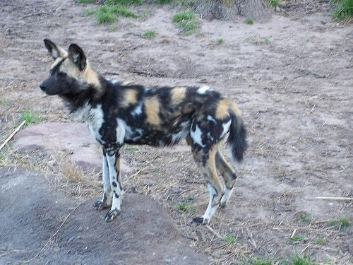

# 目录

- [目录](#目录)
- [Tiny-DarkNet描述](##Tiny-DarkNet描述])
- [模型架构](##模型架构)
- [数据集](##数据集)
- [环境要求](##环境要求)
- [快速入门](##快速入门)

## [Tiny-DarkNet描述](#目录)

Tiny-DarkNet是Joseph Chet Redmon等人提出的一个16层的针对于经典的图像分类数据集ImageNet所进行的图像分类网络模型。 Tiny-DarkNet作为作者为了满足用户对较小模型规模的需求而尽量降低模型的大小设计的简易版本的Darknet，具有优于AlexNet和SqueezeNet的图像分类能力，同时其只使用少于它们的模型参数。为了减少模型的规模，该Tiny-DarkNet网络没有使用全连接层，仅由卷积层、最大池化层、平均池化层组成。

更多Tiny-DarkNet详细信息可以参考[官方介绍](https://pjreddie.com/darknet/tiny-darknet/)

## [模型架构](#目录)

具体而言, Tiny-DarkNet网络由**1×1 conv**, **3×3 conv**, **2×2 max**和全局平均池化层组成，这些模块相互组成将输入的图片转换成一个**1×1000**的向量。

## [数据集](#目录)

以下将介绍模型中使用数据集以及其出处：
<!-- Note that you can run the scripts based on the dataset mentioned in original paper or widely used in relevant domain/network architecture. In the following sections, we will introduce how to run the scripts using the related dataset below. -->

<!-- Dataset used: [CIFAR-10](<http://www.cs.toronto.edu/~kriz/cifar.html>)  -->

<!-- Dataset used ImageNet can refer to [paper](<https://ieeexplore.ieee.org/abstract/document/5206848>) -->

所使用的数据集可参考[论文](<https://ieeexplore.ieee.org/abstract/document/5206848>)

- 数据集规模：125G，1250k张分别属于1000个类的彩色图像
    - 训练集: 120G,1200k张图片
    - 测试集: 5G, 50k张图片
- 数据格式: RGB格式图片
    - 注意: 数据将会被 preprocess.py 中的函数进行处理

## [环境要求](#目录)

- 硬件
    - 请准备具有GPU/CPU的硬件环境.
- 框架
    - [MindSpore](https://www.mindspore.cn/install)
- 更多的信息请访问以下链接：
    - [MindSpore Tutorials](https://www.mindspore.cn/tutorials/zh-CN/master/index.html)
    - [MindSpore Python API](https://www.mindspore.cn/docs/zh-CN/master/index.html)

## [快速入门](#目录)

根据官方网站成功安装MindSpore以后，可以按照以下步骤进行训练和测试模型：

### [脚本及样例代码](#目录)

```text
./tinydarknet
├── data
│    └── infer_example.JPEG
├── hub_conf.py
├── model.py
├── preprocess.py
├── label_map.json
└── README.md
```

### 推理示例

- 加载`tinydarknet_imagenet`模型并使用`infer`接口进行推理。

```python
import mindhub as hub

net = hub.Model("tinydarknet_imagenet", pretrained=True)
print(net.infer(data_path="./data/infer_example.JPEG", json_path="./label_map.json"))
```

```text
Matching local models: []
Matching remote models: ['tinydarknet_imagenet']
tinydarknet_imagenet is not installed!
4096B [00:00, 2369637.13B/s]           
20480B [00:00, 6247225.16B/s]           
4096B [00:00, 1779006.85B/s]           
5120B [00:00, 2905538.69B/s]           
4096B [00:00, 2582274.04B/s]           
Downloading data from https://download.mindspore.cn/models/r1.9/tinydarknet_ascend_v190_imagenet2012_official_cv_top1acc59.0_top5acc81.84.ckpt (10.4 MB)

file_sizes: 100%|██████████████████████████| 10.9M/10.9M [00:00<00:00, 23.1MB/s]
Successfully downloaded file to ./tinydarknet_ascend_v190_imagenet2012_official_cv_top1acc59.0_top5acc81.84.ckpt
Data Path: ./data/infer_example.JPEG
[{'275': 'African hunting dog'}]
```



