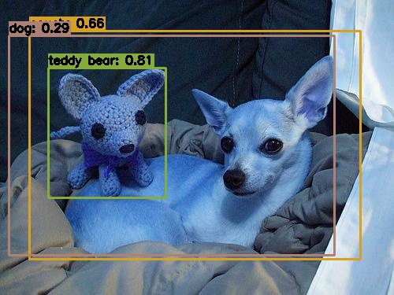

# 目录

- [目录](#目录)
- [YoloV3描述](##YoloV3描述])
- [模型架构](##模型架构)
- [数据集](##数据集)
- [环境要求](##环境要求)
- [快速入门](##快速入门)

## [YoloV3描述](#目录)

yolov3_darknet53模型是一种基于深度学习的目标检测模型，它使用了darknet53作为特征提取器，以及多尺度的特征融合和预测策略，来提高检测的精度和速度。yolov3_darknet53模型可以检测出图片中的多个目标，并给出它们的类别和位置信息。

yolov3使用了一些技巧来改进训练，提高性能，包括多尺度预测、更好的主干分类器等等，详情见论文。

[论文](https://pjreddie.com/media/files/papers/YOLOv3.pdf):  YOLOv3: An Incremental Improvement.Joseph Redmon, Ali Farhadi,
University of Washington

## [模型架构](#目录)

YOLOv3使用DarkNet53执行特征提取，这是YOLOv2中的Darknet-19和残差网络的一种混合方法。DarkNet53使用连续的3×3和1×1卷积层，并且有一些快捷连接，而且DarkNet53明显更大，它有53层卷积层。

## [数据集](#目录)

训练使用的数据集：[COCO 2014](https://cocodataset.org/#download)

- 数据集大小：19G，123287张图片，80个物体类别
    - 训练集：13G，82783张图像  
    - 验证集：6GM，40504张图像
    - 标注：241M，训练/验证标注
- 数据格式: RGB格式图片
  - 注意: 数据将会被 preprocess.py 中的函数进行处理

## [环境要求](#目录)

- 硬件
    - 请准备具有GPU/CPU的硬件环境.
- 框架
    - [MindSpore](https://www.mindspore.cn/install)
- 更多的信息请访问以下链接：
    - [MindSpore Tutorials](https://www.mindspore.cn/tutorials/zh-CN/master/index.html)
    - [MindSpore Python API](https://www.mindspore.cn/docs/zh-CN/master/index.html)

## [快速入门](#目录)

根据官方网站成功安装MindSpore以后，可以按照以下步骤进行训练和测试模型：

### [脚本及样例代码](#目录)

```text
./yolov3darknet53_coco2014
├── data
│    └── infer_example.JPEG
├── outputs
│    └── infer_example.JPEG
├── hub_conf.py
├── detection.py
├── model.py
├── preprocess.py
└── README.md
```

### 推理示例

- 加载`yolov3darknet53_coco2014`模型并使用`infer`接口进行推理。

```python
import mindhub as hub

net = hub.Model("yolov3darknet53_coco2014", pretrained=True)
print(net.infer(data_dir="./data/", outputs_dir="./outputs/", batch_size=1))
```

```text
yolov3 pretrained network model: ./yolov3darknet53shape416_ascend_v190_coco2014_official_cv_map31.8.ckpt
([], ['global_step', 'momentum', 'learning_rate'])
load_model ./yolov3darknet53shape416_ascend_v190_coco2014_official_cv_map31.8.ckpt success
No.1 image inference result has been saved in ./outputs/n02085620_3488.JPEG
Predict Result: [{'category': 'teddy bear', 'bbox': [61.15130615234375, 86.04826354980469, 149.56353759765625, 165.72116088867188],
 'score': 0.8068624138832092}, {'category': 'couch', 'bbox': [37.03753662109375, 39.5843505859375, 420.758056640625, 289.9647521972656], 
 'score': 0.6560179591178894}, {'category': 'dog', 'bbox': [11.676910400390625, 45.679107666015625, 412.79302978515625, 278.74072265625], 
 'score': 0.2859487235546112}].
```



